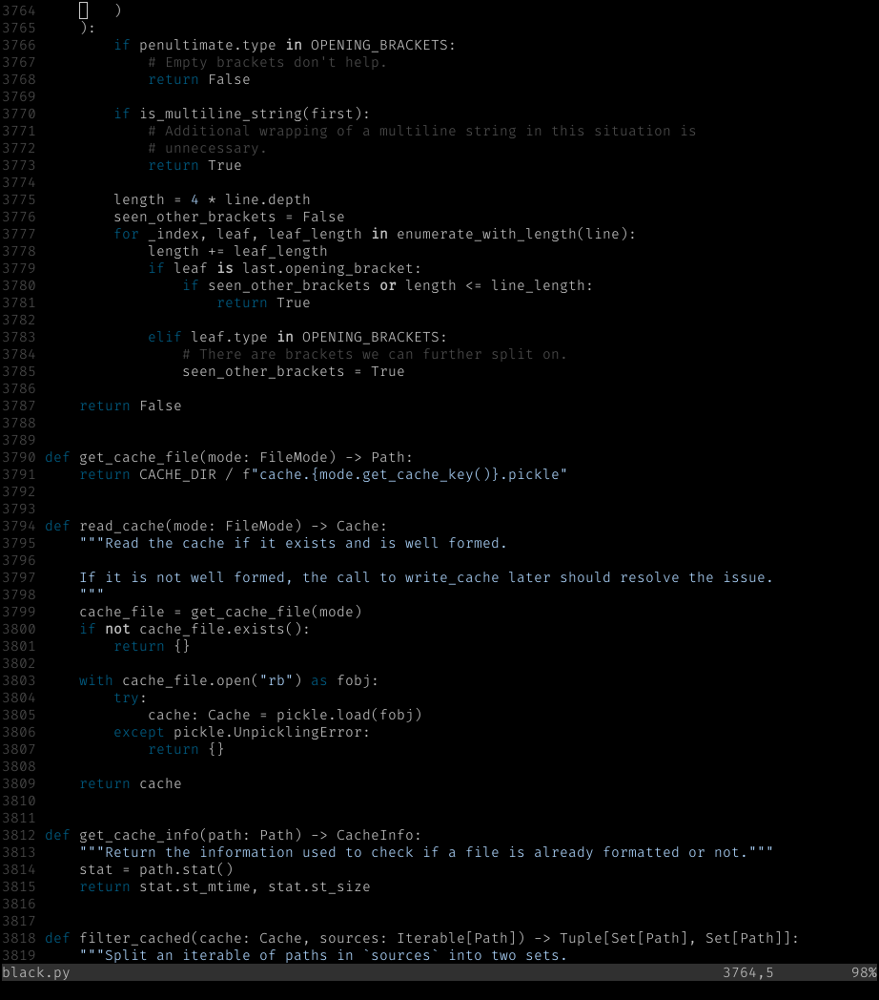

# Paramount Blue

A minimal colorscheme for Vim that only puts emphasis on the paramount.

Forked from [paramount][], which is based on [pencil][] and [off][].

[paramount]: https://github.com/owickstrom/vim-colors-paramount
[pencil]: https://github.com/reedes/vim-colors-pencil
[off]: https://github.com/reedes/vim-colors-off

## Installation

Use your favourite Vim plugin manager.

For example, using [Vundle][]:

    Plugin 'https://gitlab.com/rj-white/vim-colors-paramountblue'

[Vundle]: https://github.com/VundleVim/Vundle.vim

## Screenshot

## Usage

    :colorscheme paramountblue
